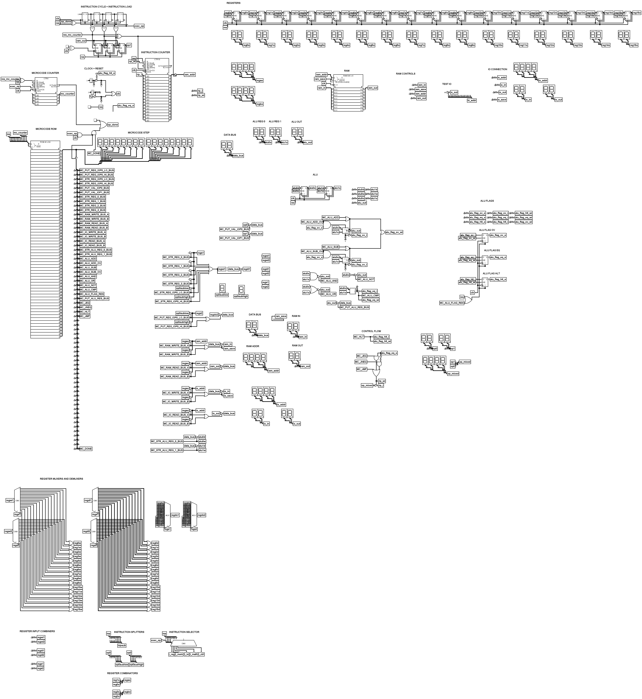

# Goofy CPU
A custom 8 bit cpu I made in logisim evolution.

It is still very WIP but currently its ALIVEEEEEEEE!

I have also made a second, more silly version [here](/goofier/)!

## Instruction Set
The instructions can be found in the `plan.txt` file.

## Microcode
The cpus microcode is generated using a c# program I made.

It can be found in the `Microcode gen` folder.

## Developing

You can now write assembly and compile it for the cpu. The stuff can be found in the `asm` folder. 
You can compile an asm file (like `examples/inc_hlt.asm`) using `customasm.exe` and then use the generated output and load that into ram.

NOTE: You need to include the `common.asm` file for customasm to work properly!

NOTE: If you are not on windows, you will need to get customasm and then it should hopefully work too.

## Images/GIFs

## Thanks to
* [Phoenix v2](https://github.com/Glowman554/phoenix-v2)
* [Customasm](https://github.com/hlorenzi/customasm)