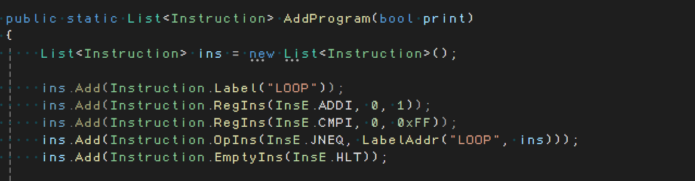
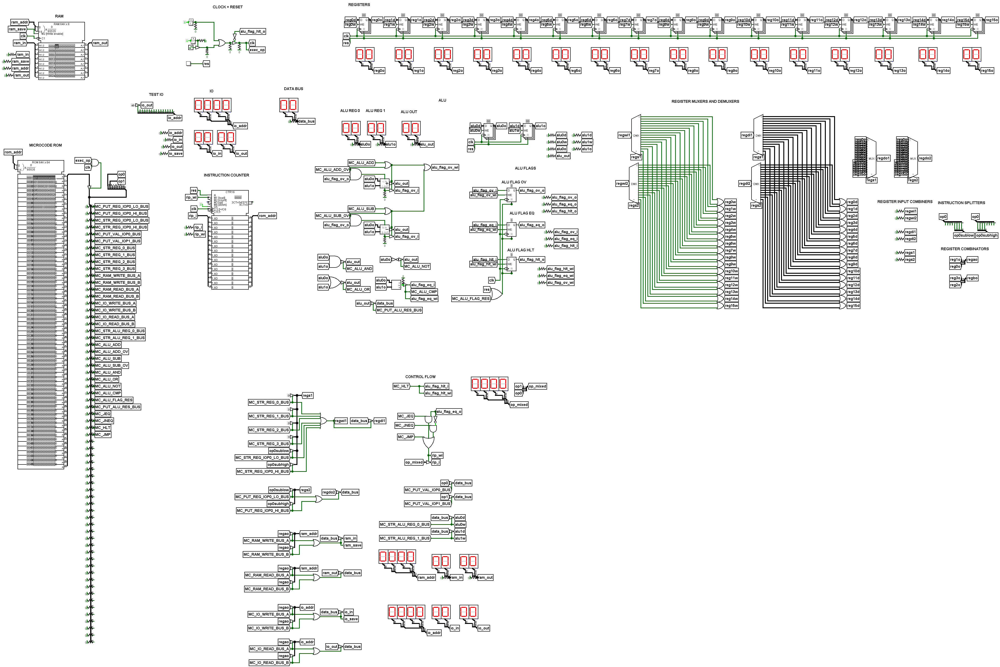

# Goofy CPU (GOOFIER EDITION)
A sillier version of [my goofy cpu](../) which runs microcode directly instead of instructions. 

This leads to a higher performance but also has way larger programs.

## Microcode / Instruction Set
The instructions can be found in the `plan.txt` file from the original cpu.

The cpu executes microcode directly which is generated using a c# project that turns the list of instructions into the corresponding microcode:

This program can be found in the `Goofy Microcode gen` folder.

## Developing

Currently you have to edit the Microcode generator program with your assembly and then load in the microcode into the rom in logisim.

## Images/GIFs

